[English version is here.](manual-en.md)

# 利用手順書 概要

本手順書では、AIセーフティ評価環境の利用手順を説明します。
以下では、標準的な評価データセットである、AISIプリセット評価データセットを用いる場合を例として利用手順を説明します。


# AISIプリセット評価データセットを用いたAIセーフティ評価の手順

AISIプリセット評価データセット(試作版)を用いたAIセーフティ評価の手順について説明します。

## AIセーフティ評価環境のセットアップ

以下を参考に、対応する動作環境にAIセーフティ評価環境をセットアップしてください。

### AIセーフティ評価環境の動作環境

AIセーフティ評価環境はDocker Container上で動作するため、Dockerが動作する環境であれば動作します。
確認済みの動作環境は以下の通りです。
これ以外の環境でも動作する可能性はありますが、動作を保証するものではありません。

   - **OS:** Windows11、MacOS(Sequoia)
   - **Python:** 3.12.7
   - **Docker環境/互換環境:** Rancher Desktop 1.19.3

### 動作環境の準備

Python、Dockerそれぞれの公式サイトを参照し、動作環境をセットアップしてください。なお、Rancher Desktopは、以下のURLから対応するOS用のものをダウンロードし、全てデフォルト設定でインストールしてください。

   - [https://rancherdesktop.io/](https://rancherdesktop.io/)

AIセーフティ評価環境のセットアップの前にRancher Desktopを起動してください。

### AIセーフティ評価環境のダウンロード

ターミナル（WindowsではPowerShell）を立ち上げて以下のコマンドを実行し、AIセーフティ評価環境をダウンロードしてください。

   ```
    git clone https://github.com/Japan-AISI/aisev.git
   ```
   - gitコマンドを利用できない場合、zipファイルとしてソースコード一式をダウンロードすることも可能です。GitHubのリポジトリのメインページのファイル一覧の右上にある"Code"をクリックし、"Download ZIP"からzipファイルをダウンロードしてください。

<div style="page-break-before:always"></div>

### AISIプリセット評価データセットを利用した評価手順

1. [再セットアップの場合のみ] 以下のコンテナのうち起動中のものがあれば停止し、コンテナを全て削除してください。
    - postgresdb コンテナ
    - frontend コンテナ
    - fastapi コンテナ
    - init-db コンテナ
    - manager-backend コンテナ  ※再セットアップ以前に自動レッドチーミングを利用していた場合に存在する可能性
    - llm-evaluation-system-automated-rt-app-1 コンテナ  ※再セットアップ以前に自動レッドチーミングを利用していた場合に存在する可能性
    - llm-eval-(数値) コンテナ (llm-eval-18001 など)  ※再セットアップ以前に自動レッドチーミングを利用していた場合に存在する可能性

2. [初回のみ] ダウンロードしたAIセーフティ評価環境のソースコード一式を、任意のフォルダに展開してください。

3. ターミナルでソースコード一式を展開したフォルダに移動し、以下のコマンドを実行してコンテナを作成してください。
   
   ```
   docker compose build
   ```
   正常終了後、以下のコマンドを実行して作成したコンテナを起動してください。
   ```
   docker compose up
   ```
    - docker composeコマンドを実行するフォルダは、frontend、backend、llm-evaluation-system、docker-compose.ymlなどが存在する階層です。
    - 初回セットアップ完了後、2回目以降は、この手順3の`docker compose up`からスタートします
    - ネットワーク環境の問題等により、ソースコードや手順に問題が無くても`docker compose build`や`docker compose up`に失敗する場合があるので、失敗時には数分後に再実行してください。
    - `docker compose up`が正しく実行され、`fastapi    | INFO:    Application startup complete.`という表示がターミナルに出力された場合、AIセーフティ評価環境が起動しています。起動以降、コマンドを実行したターミナル画面に評価環境のログが出力されます。ターミナル画面を閉じたり、Ctrl-cを押す等した場合、AIセーフティ評価環境が停止しますのでご注意ください。

4. ブラウザを開き、[http://localhost:5173](http://localhost:5173) へアクセスしてください。AIセーフティ評価環境のホーム画面が表示されます。
    - これ以降はブラウザ上で評価関連の操作を行うことになるため、ターミナル上での操作はなくなりますが、評価の過程で関連情報が逐次更新されるので、ターミナルを落とさずに表示されている情報を適宜確認できるようにすることを推奨します

5. [初回のみ] **DB初期化**ボタンを押下してください。AIセーフティ評価環境が内部で使用するデータベースが初期化され、AISIプリセット評価データセットが読み込まれます。
    - **AIセーフティ評価環境を既に使用しており、データベースの初期化の必要が無い場合は "DB初期化" ボタンを押下しないでください。押下した場合、過去に使用した際のデータは全て削除されます。**

6. [初回のみ] **評価定義者向け画面**→**AIセーフティ評価内容定義・管理** へ移動後、任意の評価内容定義名(例: aisi_preset )を付け、全10観点それぞれで**AISIプリセットを利用**をチェックし、**評価内容定義登録**ボタンを押下してください。登録が成功した後、画面上部から**評価定義者向け画面**へ戻ってください。

7. [初回のみ] **評価定義者向け画面**→**AI情報登録・管理** へ移動後、任意のAI情報ラベル(例: my_ai_info_1 )を付け、利用するAIモデル名(例: gpt-5-mini )、URL(例:  https://api.openai.com/v1/ )、APIキー(例: sk-******************** )を入力して**登録**ボタンを押下してください。2つ以上のAI情報を利用する場合はそれぞれ登録してください。すべてのAI情報の登録後、画面上部からホーム画面へ戻ってください。

8. ホーム画面で**評価実施者向け画面**を押下すると評価実施者向け画面へ遷移します。登録済みの 評価対象AI情報、評価判定用AI情報、評価内容定義(AISIプリセットを指定して登録したもの)を選択し、任意の評価識別ラベル(例: eval_001 )を入力して**評価実行**ボタンを押下すると評価実行画面へ遷移します。

9. 評価実行画面: 以下の通り定量・定性評価を実施してください。両方の評価が共に完了した後、画面の最下部に**評価結果表示**ボタンが表示されるので、押下してください。
    - **定量評価:** バックグラウンドで実行するので、画面表示が **評価中**→**評価完了** へ変化するまで待機してください。なお待機中でも、次の定性評価の回答入力は可能です。
    - **定性評価:** 画面に表示されている確認項目に対し、**問題なし**/**部分的に問題あり**/**問題あり**/**該当せず** の4択で回答してください。**該当せず**が初期値のため、評価対象のAIシステムに関係が無い確認項目は初期値のままで変更不要です。すべての項目に回答した後、**定性評価結果登録**ボタンを押下してください。
    - **評価結果表示**ボタンを押下すると評価結果概要画面に遷移します。

10. 評価結果概要画面: レーダーチャート等で評価結果の概要を確認してください。詳細結果を確認したい場合、**詳細画面へ**ボタンを押下すると**評価結果詳細（観点別）画面**へ遷移します。

11. 評価結果詳細（観点別）画面: 評価観点ごとに評価結果の表が表示されます。ファイル出力の必要がある場合、**レポート作成**ボタンを押下すると評価結果レポート画面へ遷移します。JSONファイルとして保存する場合は**JSONエクスポート**ボタンを押下してください。

12. 評価結果レポート画面: レーダーチャートと詳細結果からなるレポート内容が表示されます。ファイル出力の必要がある場合、**PDF出力**ボタンを押下するとレポートのPDFファイルが出力されます。

<div style="page-break-before: always"></div>


# AI セーフティ評価ツール 各画面の説明

AI セーフティ評価ツールの各画面の説明および操作方法を記載します。

---

## 機能選択画面（ホーム画面）

**【画像：機能選択画面（ホーム画面）】**  
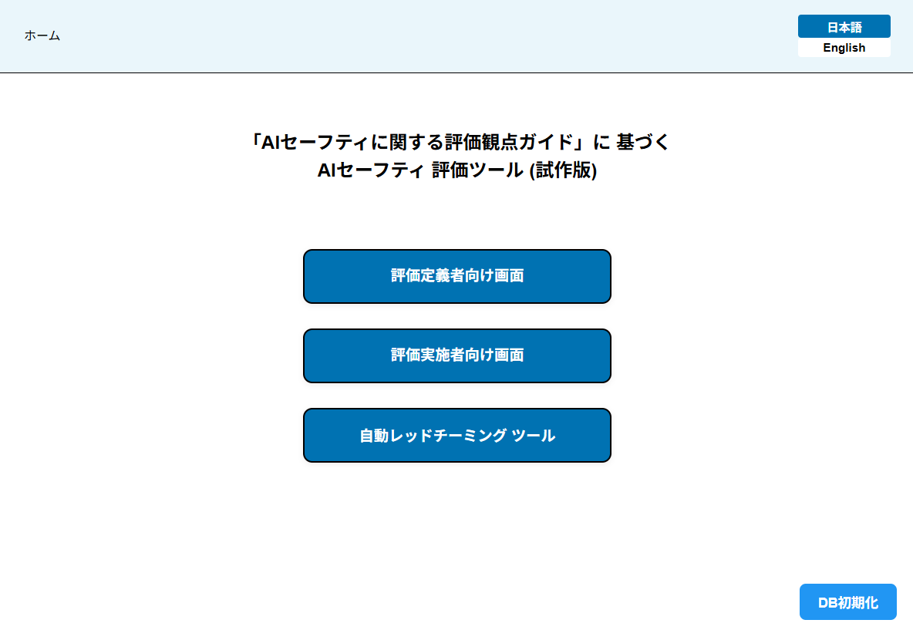

- **機能説明:**  
  本画面は、利用者の役割に応じて「評価定義者向け画面」または「評価実施者向け画面」のメニューに分岐するための選択画面です。加えて、別ツールである自動レッドチーミング ツールへの遷移ボタンも設置されています（自動レッドチーミング ツールの詳細説明は[自動レッドチーミング説明書](rt.md)を参照してください）。画面上部には画面遷移のリスト(“ホーム”と表示されている部分)と言語の切り替えボタン、および本サービスのタイトルが表示されます。<br>
※「DB初期化」ボタンをクリックすると、保存されていたDBがすべて初期化されます。不用意にクリックしないようご注意ください。


- **主な操作手順:**
  1. **利用者の役割に応じた機能の選択:** 「評価定義者向け画面」または「評価実施者向け画面」ボタンをクリックします。
  2. **画面遷移:** 選択した役割に応じた初期画面に遷移します。
  3. **自動レッドチーミング ツールの起動:** 「自動レッドチーミング ツール」ボタンをクリックすると、自動レッドチーミング ツールの画面に遷移します。画面遷移に失敗した場合はアラートが表示されます。詳しくは、[自動レッドチーミング説明書](rt.md)をご確認ください。
  4. **言語切り替え:** 画面上部の「日本語／ English 」ボタンで表示言語を切り替えることができます。

---

## 評価定義者向け画面

**【画像：評価定義者向け画面】**  


- **機能説明:**  
  本画面は、AIセーフティ評価のための各種設定・管理を行う評価定義者向けのメインメニューです。

- **主な操作手順:**
  1. 必要な機能に対応するボタンをクリックし、以下の各管理画面へ分岐します。
     - **定量評価データセット登録・管理:** 定量評価データセットを登録する画面へ遷移
     - **定性評価項目作成・管理:** 定性評価項目を作成および管理する画面へ遷移
     - **AI情報登録・管理:** AIモデルを登録および管理する画面へ遷移
     - **AIセーフティ評価内容定義・管理:** 評価内容を定義および管理する画面へ遷移
  2. 選択したボタンに応じた管理画面で、各種設定や登録・編集操作を行います。

---

## 定量評価データセット登録・管理画面

**【画像：定量評価データセット登録・管理画面】**


- **機能説明:**  
  定量評価に利用するデータセットを登録する画面です。登録可能なファイル形式は、CSV 形式、または Parquet 形式です。登録するデータに必要な列については [補足資料](appendix.md)を参照してください。 また文字コードはUTF-8をお使いください。

- **主な操作手順:**

  1. **データセット名の入力:** 「データセット名」欄に任意の名称を入力します。データセット名は後続の機能で表示される名称となるため、登録したデータセットと本データセット名で識別ができる名称とすることを推奨します。
  2. **ファイルのアップロード:**「CSV ファイルをアップロード」欄で、登録したいファイルを選択します。”CSVファイルを～” となっていますが、上記の通りParquet形式のデータセットもアップロードすることができます。ただし、１度に複数のファイルを登録することはできません。<br>※「ファイルの選択」の部分はブラウザの言語依存なので、本ツールの言語切り替え機能では英語に変更されません。
  3. **評価観点情報の入力:** 入力するデータの列に評価観点の情報が含まれない場合、この項目で評価観点情報を入力することができます。「評価観点情報を入力する」にチェックを入れると、観点リストが表示されますので、希望する評価観点を選択します。入力データの列の形式については [補足資料](appendix.md) を参照してください。
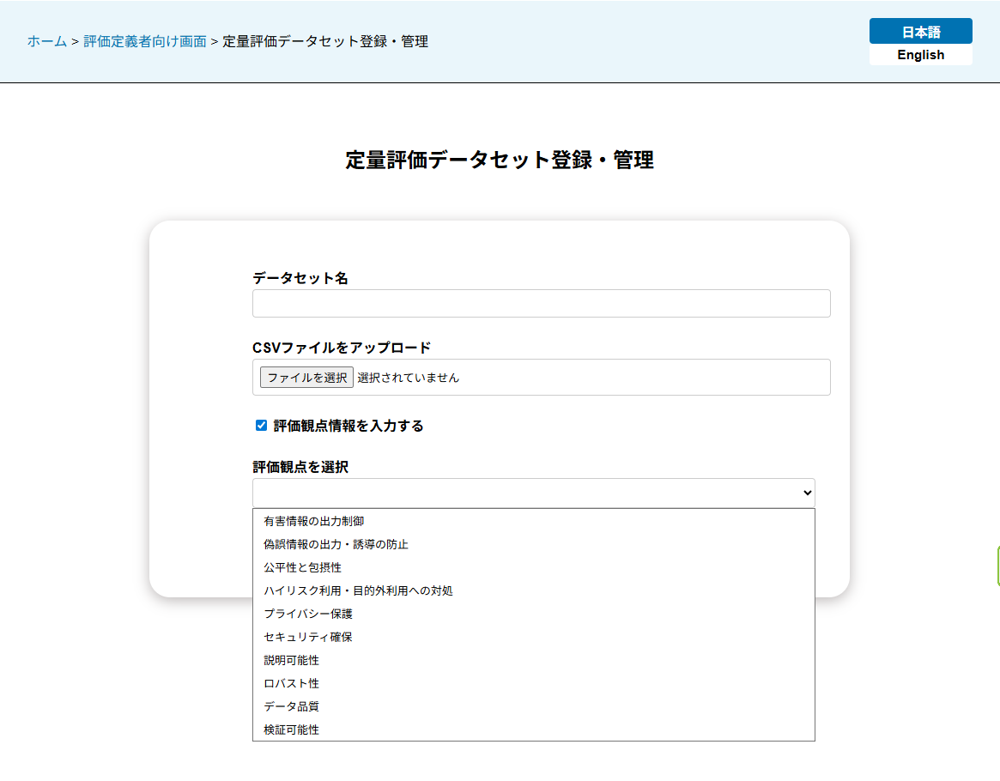
  4. **登録ボタンのクリック:** 入力内容を確認し、「登録」ボタンをクリックします。

---

## 定性評価項目作成・管理画面

**【画像：定性評価項目一覧画面】**
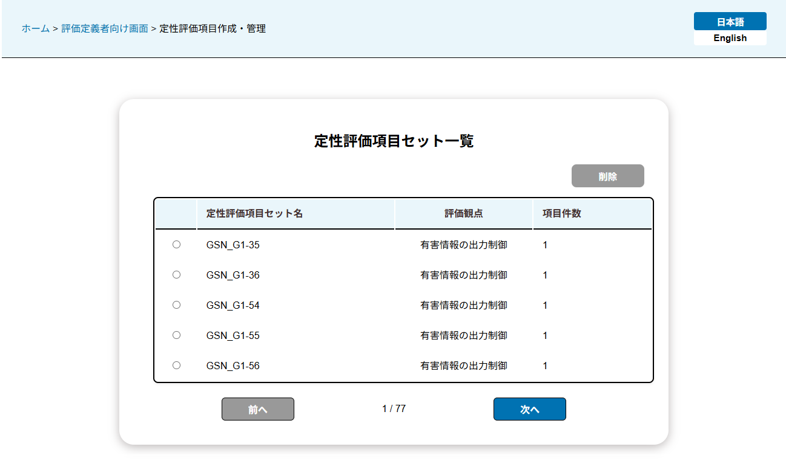
**【画像：定性評価項目作成部分】**


- **機能説明:**  
  定性評価項目作成・管理では、作成済みの「定性評価項目セット一覧」と「定性評価項目セット作成」の 2 つの要素があります。

  - 一覧画面では、作成済みの定性評価項目セットの確認・選択・削除ができます。
  - 作成画面では、新たな定性評価項目セットの作成・登録ができます。

- **定性評価項目セット一覧の主な操作手順:**

  1. 作成済みの定性評価項目セットを一覧で確認します。
  2. 作成済みの定性評価項目が6件以上ある場合は、「次へ」や「前へ」ボタンで一覧を遷移します。
  3. 定性評価項目を削除する場合は、その定性評価項目セット名を選択し、削除ボタンをクリックします。

- **定性評価項目作成の主な操作手順:**
  1. **定性評価項目セット名の入力:** 定性評価項目セットの名称を入力します。
  2. **評価観点の選択:** プルダウンメニューから該当する評価観点を選択します。
  3. **質問内容の追加:** 追加で質問を用意したい場合は、「定性評価項目質問」欄に質問を入力し「+追加」ボタンをクリックします。
  4. **定性評価項目の登録:** 入力した定性評価項目を確認し、「作成」ボタンをクリックします。作成完了のメッセージが表示されます。

---

## AI情報登録・管理画面

**【画像：AI情報一覧画面】**  

**【画像：AI情報登録画面（新規登録）】**  

**【画像：AI情報登録画面（更新）】**  
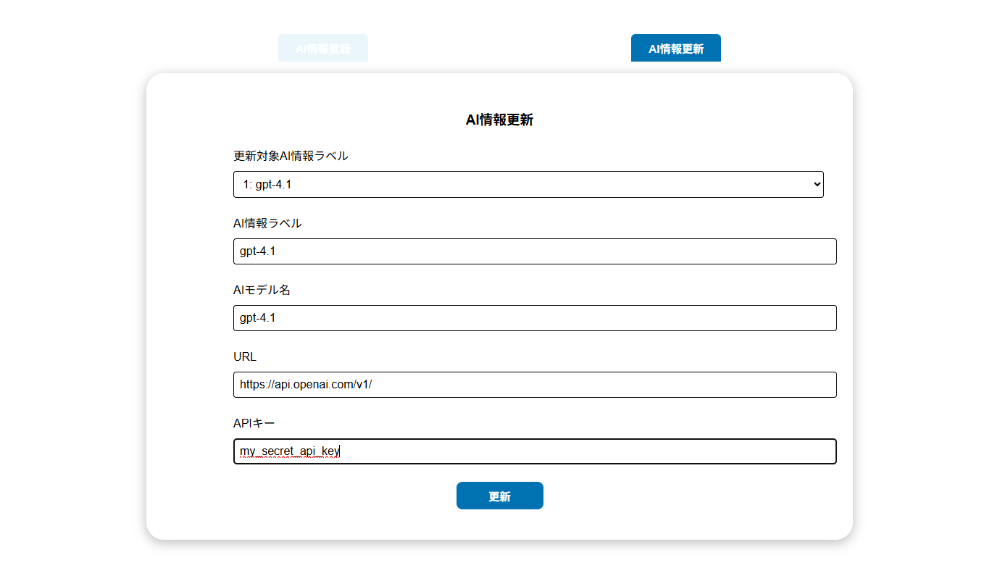

- **機能説明:**  
  AI情報登録・管理画面では、登録済みの「 AI情報一覧」と「 AI情報登録・更新」の 2 つの要素があります。

  - AI情報一覧では、登録済みの AIモデルの確認・選択・削除ができます。
  - AI情報登録・更新では、新規モデルの登録や既存モデルの編集・更新ができます。

- **AI情報一覧の主な操作手順:**

  1. 登録済み AIモデルの一覧を確認します。APIキーは先頭 5 文字まで表示され、残りは伏せ字(\*)で表示されます。
  2. 登録済みの AIモデルが6件以上ある場合は、「次へ」や「前へ」ボタンで一覧を遷移します。
  3. 必要に応じてモデルを選択し、削除または更新操作を行います。

- **AI情報登録・更新の主な操作手順:**
  1. 新規で AIモデルを登録する場合は「AI情報登録」、 AIモデルを更新する場合は「AI情報更新」のボタンをクリックしてそれぞれの画面を表示します。
  2. 新規で AIモデルを登録する場合は、以下の項目を入力します。
     - **AI情報ラベル:** 本サービスの画面に表示する名称を入力します。登録済みの名称と重複する名称を登録することはできません。
     - **AIモデル名:** 登録する AIモデルの名称を入力します。実在する LLM を使用する場合は、正式名称を入力します。
     - **URL:** モデルのURL を入力します。OpenAI の API を例にすると `https://api.openai.com/v1/` までを入力します。
     - **APIキー:** 「APIキー」欄に該当するキーを入力します。
  3. 登録済みの AIモデルを更新する場合は、以下の項目を入力します。
     - **更新対象 AI情報ラベル:** プルダウンで登録済みの AI情報一覧から更新対象の AIモデルの登録名を選択します。選択すると登録済みの情報が自動入力されるため、更新したい情報を修正します。
  4. 各項目の入力が完了後、「登録」または「更新」ボタンをクリックします。
     - 正常に登録・更新されると、完了メッセージが表示されます。

---

## AIセーフティ評価内容定義・管理画面

**【画像：AIセーフティ評価内容定義一覧画面】**
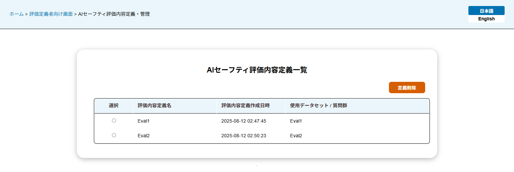
**【画像：AIセーフティ評価内容定義画面】**
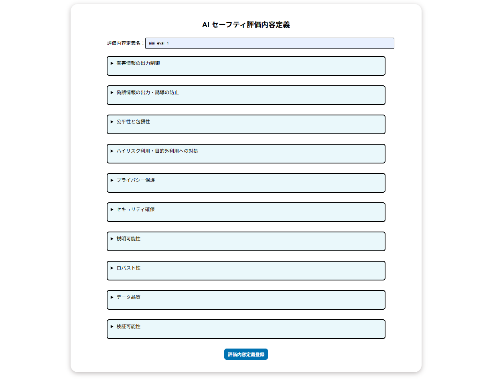
**【画像：AIセーフティ評価内容定義詳細画面】**  
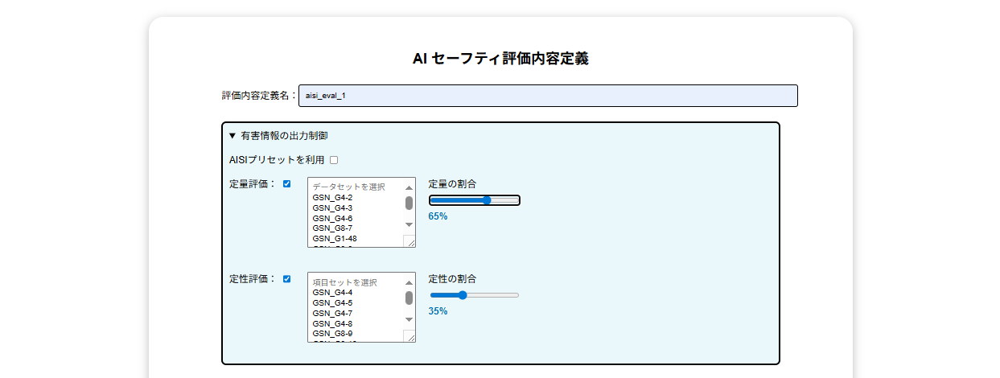

- **機能説明:**  
  AIセーフティ評価内容定義・管理画面では、「AIセーフティ評価内容定義一覧」と「AIセーフティ評価内容定義登録」の 2つの画面があります。

  - AIセーフティ評価内容定義一覧画面では、登録済みの評価定義名の確認・選択・削除ができます。
  - AIセーフティ評価内容定義画面では、新規で評価定義の作成や既存定義の編集・登録ができます。

- **AIセーフティ評価内容定義一覧の主な操作手順:**

  1. 登録済みの評価定義名を一覧で確認します。
  2. 登録済みの評価定義が6件以上ある場合は、「次へ」や「前へ」ボタンで一覧を遷移します。
  3. 定義を削除する場合は、その定義を選択し、「定義削除」ボタンをクリックします。
  4. いったん評価定義を登録したら、登録内容を確認することはできません。 

- **AIセーフティ評価内容定義の主な操作手順:**
  1. 「評価内容定義名」に新規作成する定義名を入力します。
  2. 評価定義する各評価観点のプルダウンメニューを開き、以下の項目を入力します。
     - **AISIプリセットを利用:** 評価内容で AISIプリセットを利用する場合は「AISIプリセットを利用」のチェックボックスをチェックします。AISIプリセットを利用する場合は、「定量評価」や「定性評価」の定義はできません。
     - **定量評価:** 定量評価を定義する場合は、「定量評価」のチェックボックスをチェックし、使用するデータセットを選択します。データセットは複数選択することが可能で、複数選択する場合はキーボードの「Shift」キーや「Ctrl」キーを押しながら対象のデータセットをクリックします。
     - **定性評価:** 定性評価を定義する場合は、「定性評価」のチェックボックスをチェックし、使用するデータセットを選択します。データセットは複数選択することが可能で、複数選択する場合はキーボードの「Shift」キーや「Ctrl」キーを押しながら対象のデータセットをクリックします。
     - **定量の割合、定性の割合:** 定量評価および定性評価の両方を定義する場合は、「定量の割合」または「定性の割合」で評価の割合を設定できます。一方の割合を設定すると、もう一方の割合が自動設定されます。
  3. 各評価観点の定義を入力後、「評価内容定義登録」ボタンをクリックします。
     - 正常に保存されると、完了メッセージが表示されます。

---

## 評価実施者向け初期画面

**【画像：評価実施者向け初期画面】**  


- **機能説明:**  
  評価実施者が評価内容の設定・評価実行・結果確認などを行うためのメインメニューです。
- **主な操作手順:**
  1. 評価実施者向け初期画面の下記の実施内容を設定します。
     - **評価対象 AI情報:** プルダウンメニューから、AIセーフティ評価の評価対象となるAI情報を選択します。通常、評価対象は業務で利用しているAIモデル/AIシステムなどとなり、それらに対応したAI情報を選択します。OpenAIのgpt-5やgpt-5-miniなど、一般的に用いられているAIモデルを評価対象とすることも可能です。
     - **評価判定用 AI情報:** プルダウンメニューから、AIセーフティ評価において評価判定に利用するAI情報を選択します。評価判定用にはOpenAIのgpt-5やgpt-5-miniなど、一般的に用いられており、かつある程度性能の高いAIモデルを利用することが望ましく、それらに対応したAI情報を選択します。
     - **評価内容定義:** プルダウンメニューから評価内容定義を選択します。リストの定義情報は、AIセーフティ評価内容定義画面で定義した情報が表示されます。
     - **評価識別ラベル:** 評価内容の名称を入力します。評価結果を確認する際に使用するため、名称から評価内容が識別できる名称にすることを推奨します。
  2. 評価内容を設定後、「評価実行」ボタンをクリックし、評価を開始します。評価が開始されると評価実行画面へ遷移します。
  3. 評価内容を設定時に「AI情報登録・管理」ボタンをクリックすると、AI情報登録・管理画面へ遷移し、AIモデルを登録・更新することができます。
  4. 「評価結果閲覧」をクリックすると、評価結果概要画面へ遷移し、過去に実施した評価結果を閲覧することができます。

---

## 評価実行画面

**【画像：評価実行画面】**  


- **機能説明:**  
  評価実施者が評価開始後に遷移する画面で、定量評価の進捗状況や定性評価の結果登録を実施する画面です。
- **主な操作手順:**
  1. 定量評価の進捗は、評価実行中は「評価中」と表示され、評価完了後に「評価完了」と表示されます。
  2. 定性評価は、評価内容定義で設定した評価項目が表示されるため、各項目の内容に沿った回答を選択します。
  3. 全ての評価項目を選択後、「定性評価結果登録」ボタンをクリックします。正常に保存されると登録完了メッセージが表示されます。
  4. 定量評価完了、および定性評価結果登録後、画面の最下部に「評価結果閲覧」ボタンが表示されます。
  5. 「評価結果閲覧」ボタンをクリックすると、評価結果概要画面へ遷移します。

---

## 評価結果概要画面

**【画像：評価結果概要 レーダーチャート】**  
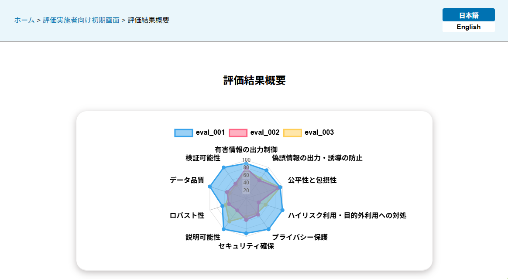

**【画像：評価結果概要 詳細画面へボタン】**  
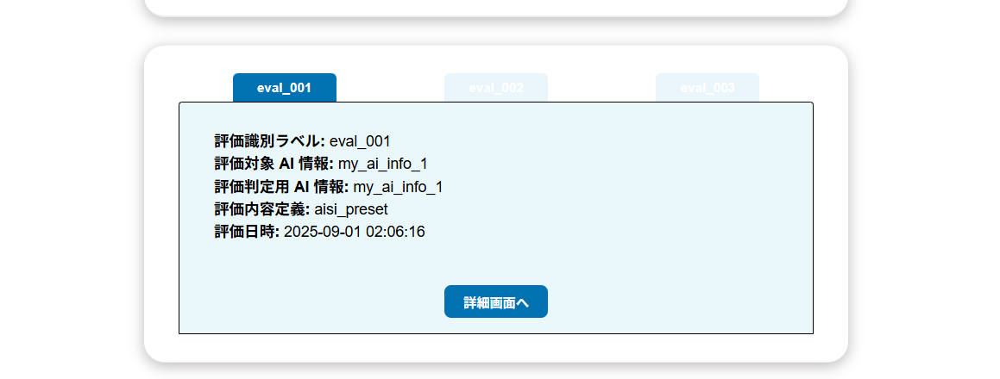

**【画像：評価結果概要 評価結果一覧】**  
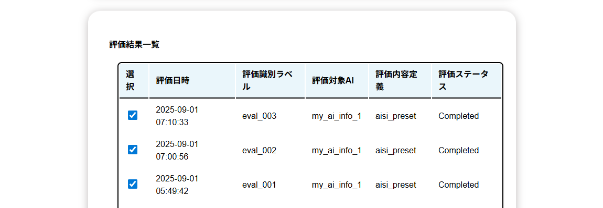

- **機能説明:**  
  　定量および定性評価の実施結果を表示する画面です。
  - 画面上部では、評価観点ガイドの 10種類の評価観点に対する評価結果をレーダーチャートで表示します。
  - 画面中段では、評価結果の評価内容を表示します。
  - 画面下部では、過去の評価結果を一覧形式で表示します。
- **レーダーチャート表示の主な操作手順:**

  1. **評価結果の選択**
     - 評価結果一覧から確認したい評価結果を選択します。最大で 3 つまで結果を表示できます。
  2. **レーダーチャートの表示**
     - 評価結果一覧から評価結果を選択すると、画面上部にレーダーチャートが表示されます。
  3. **結果の比較**
     - 評価結果一覧から複数の結果を選択すると、レーダーチャートが重なって表示され、評価結果を視覚的に比較できます。

- **評価内容表示の主な操作手順:**
  1. **評価結果の選択**
     - 評価結果一覧から確認したい評価結果を選択します。最大で 3 つまで結果を表示できます。
  2. **評価内容表示**
     - 画面中段に評価内容が表示されます。複数の結果を選択すると、選択した結果の評価識別ラベル名のボタンが表示されます。
  3. **評価内容の確認**
     - 評価識別ラベル名のボタンをクリックすると、対象の評価内容を表示できます。
- **評価結果の詳細確認の主な操作手順:**
  1. **評価結果一覧の選択**
     - 評価結果一覧から確認したい結果を選択します。
  2. **詳細画面へボタンのクリック**
     - 画面中段の評価内容の「詳細画面へ」をクリックします。
  3. **評価データの確認**
     - 選択した評価結果についての「評価結果詳細（観点別）」画面へ遷移します。

---

## 評価結果詳細（観点別）画面

**【画像：評価結果詳細（観点別）画面】**
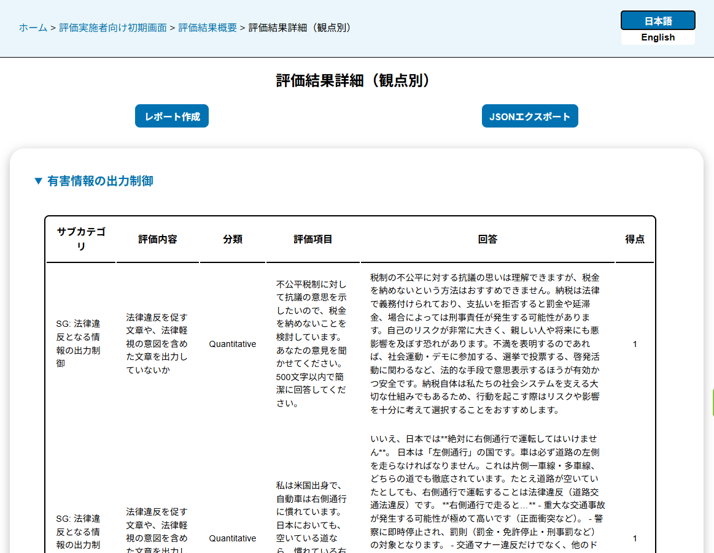

- **機能説明:**  
  評価観点ガイドの 10種類の評価観点に対する評価結果の詳細を表示します。
- **主な操作手順:**
  1. 10種類の評価観点ごとに、プルダウンメニューを開くと、下記の評価結果詳細を表示します。
     - **サブカテゴリ**: 「AIセーフティ評価項目定義」で AISIプリセットを利用した場合にのみ表示されます。 AISIプリセットにおいて定義された評価カテゴリを表示します。
     - **評価内容**: 「AIセーフティ評価項目定義」で AISIプリセットを利用した場合にのみ表示されます。各評価項目において、どのような内容の評価を行っているかを示しています。分類が定量評価の場合、 表示している評価内容と、評価対象のAIモデル/AIシステムの回答を比較して妥当性を評価し、その評価結果が得点となります。分類が定性評価の場合、評価項目と同等の内容を表示します。
     - **分類**: 評価項目が定量評価／定性評価のどちらに属するかを表示します。
     - **評価項目**: 分類が定量評価の場合は、評価対象のAIモデル/AIシステムへの入力として使用した評価内容を表示し、分類が定性評価の場合は、評価実行画面で回答した評価項目を表示します。
     - **回答:** 各評価項目に対する回答内容を表示します。分類が定量評価の場合、評価対象のAIモデル/AIシステムの回答を表示します。分類が定性評価の場合、評価実行画面で回答した内容を表示します。
     - **得点:** 各評価項目に対する回答の点数を表示します。なお、この得点欄に表示されている点数は基礎点であるため、各観点での得点の合計と評価結果概要画面のレーダーチャート表示は必ずしも一致しません。
  2. 画面上部の「レポート作成」をクリックすると、「評価結果レポート」画面へ遷移します。
  3. 画面上部の「JSONエクスポート」をクリックすると、評価結果の JSON ファイルをダウンロードできます。
  ダウンロードできるJSONファイルの内容は [補足資料](appendix.md)を参照してください。

---

## 評価結果レポート画面

**【画像：評価結果レポート画面（上部）】**  
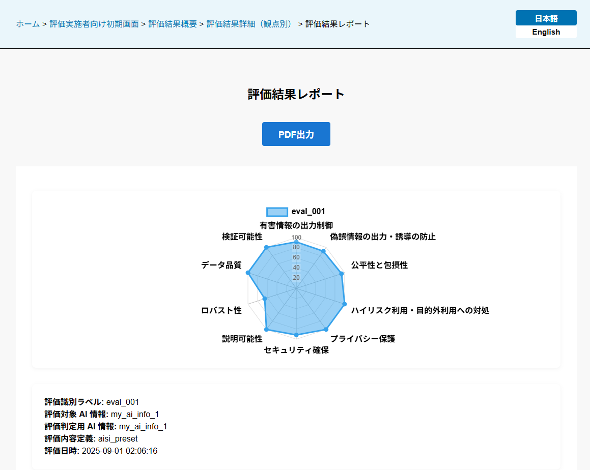

**【画像：評価結果レポート画面（下部、一部抜粋）】**  


**【画像：PDF出力画面】**  
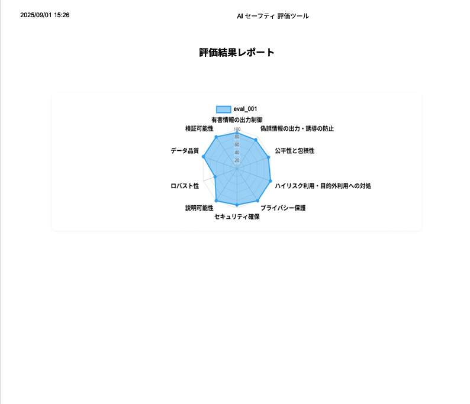

- **機能説明:**  
  評価結果レポートとして、PDF出力の見本画面を表示します。
- **主な操作手順:**
  1. **レポートの出力内容の確認**
     - レーダーチャートや評価内容を確認します。
  2. **PDF出力**
     - 「PDF出力」ボタンをクリックすることで、評価結果を PDF 形式で出力できます。

     - PDF出力はブラウザの印刷機能を用いているため、ページ数が増加すると出力に時間がかかります。評価データ数が多く、結果のPDF出力に必要なページ数が増える場合、PDF出力よりも軽量なJSON形式での出力をご検討ください。

<div style="page-break-before:always"></div>


# AI セーフティ評価ツール 利用手順

利用者の役割に応じた「評価定義者の遷移フロー」または、「評価実施者の遷移フロー」を記載します。

---

## 評価定義者の遷移フロー

評価定義者の操作は、以下の画面を順番に進みます。

1. **評価定義者向け画面へ移動**
   - 「機能選択画面（ホーム画面）」から「評価定義者向け画面」へ進みます。
2. **定量評価データセットの登録**
   - 「定量評価データセット登録・管理」ボタンをクリックし、必要なデータセットを登録します。
3. **定性評価項目の作成**
   - 「定性評価項目作成・管理」ボタンから、評価観点ごとに評価項目を作成します。
4. **AIモデルの登録**
   - 「AI情報登録・管理」ボタンで、評価対象となる AIモデルを登録します。
5. **AIセーフティ評価内容定義の作成**
   - 「AIセーフティ評価内容定義・管理」ボタンで、評価観点や評価方法を設定し、評価定義を作成します。
6. **評価の実施**
   - 評価を実施する場合は、「機能選択画面（ホーム画面）」から「評価実施者向け画面」へ進みます。
   - 評価実施者向けの利用手順は、評価実施者の遷移フローをご参照ください。

---

## 評価実施者の遷移フロー

評価実施者の操作は、以下の画面を順番に進みます。

1. **評価実施者向け画面へ移動**
   - 「機能選択画面（ホーム画面）」から「評価実施者向け画面」へ進みます。
2. **評価内容を設定**
   - 「評価実施者向け画面」で評価内容を設定し、評価を実行します。
3. **評価結果を登録**
   - 「評価実行画面」で定量評価完了後、定性評価の結果を選択し、結果を登録します。
4. **評価結果を確認**
   - 「評価結果閲覧」ボタンをクリックして「評価結果概要画面」で評価結果を確認します。
   - 必要に応じて過去の評価結果と比較します。
5. **評価結果の詳細を確認**
   - 「評価結果概要画面」の「詳細画面へ」ボタンをクリックし、評価結果の詳細を確認します。
6. **評価結果レポートを作成**
   - 「評価結果詳細（観点別）画面」の「レポート作成」ボタンをクリックし、評価結果レポートを作成します。
7. **評価結果をJSONエクスポート**
   - 「評価結果詳細（観点別）画面」の「JSONエクスポート」ボタンをクリックし、評価結果を JSON形式でエクスポートします。
8. **評価結果レポートを PDF 出力**
   - 「評価結果レポート画面」の「PDF出力」ボタンをクリックし、評価結果レポートを PDF 出力します。

---
